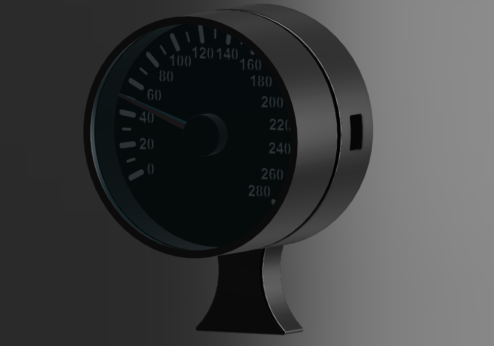
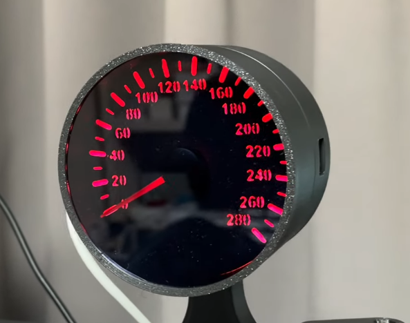

# TachoMeter

Speed(Km) / RPM 

## Credits

- **Design:** Lee Chiwon 
- **Development:** Lee Chiwon 
- **RGB Matix : ** Lee Chiwon

 

## 🎥 Video

---

# Hardware Wire

| Function    | Arduino | Ring LED Matrix | Single LED  | Motor  |
| ----------- | ------- | ------- | --------- |--------- |
| 5V                 | 5V          | 5V       | 5V          |
| GND                | GND         | GND      | GND         |
| Ring LED Matrix    | D6          | IN       |             |
| Single LED Bar     | D5          |          | IN          |
| Motor              | D9,D10,D11  |          |             | 1(D9), 2,3(D10), 4(D11)

 
---

# Part List 

|   Name              | EA | Site | Note | 
| ------------------- | ------ | --- | ------ |
| Arduino Nano   | 1 |  [Buy](https://smartstore.naver.com/misoparts/products/5779944205)| 국/내외 어디든 상관업음.
| Ring LED Matrix    | 1 |  [Buy](https://detail.tmall.com/item.htm?id=1035090948535&mi_id=0000gUlrvtFu5S64t1tqCFNuhOtfLKPjiB9Ap2ZIUPpeNy4&spm=tbpc.boughtlist.suborder_itempic.d1035090948535.37872e8dsNpH7A)| 16비트  WS2812 5050 RGB
| Single LED Bar    | 1 |  [Buy](https://detail.tmall.com/item.htm?id=1035090948535&mi_id=0000gUlrvtFu5S64t1tqCFNuhOtfLKPjiB9Ap2ZIUPpeNy4&spm=tbpc.boughtlist.suborder_itempic.d1035090948535.37872e8dsNpH7A)| 1비 WS2812 5050 RGB
| Motor    | 1 |  [Buy](https://item.taobao.com/item.htm?id=870730991204&mi_id=0000n-07sKJFhfhpx9YGWCMUwfIjtIyYDDo7LgTZTDCHjzY&spm=tbpc.boughtlist.suborder_itempic.d870730991204.37872e8dsNpH7A)| VID29-05
| Niddle    | 1 |  [Buy](https://item.taobao.com/item.htm?id=628805205024&mi_id=0000VkYcTL-KCI6JeJgxI6kfm_Xa8mfk7scPdLdVH7bH12c&spm=tbpc.boughtlist.suborder_itempic.d628805205024.37872e8dsNpH7A)| 36mm
| Acryl    | 1 |  [Buy](https://smartstore.naver.com/me41)| 3T 스모그/ 3D Print 폴더내 82.5mm 도면가지고 의뢰 하세요. 개당 1600원정도

# 3D Print

| Name |  EA  | Note |
| --- |  ------ |------ |
| 

  |  1EA  | 
| 

  |  1EA  | 
| 

  |  1EA  | 

# Simhub Arduino Setting

 * 8 LED Bar *
1. WS2812B RGB leds Count  = 8
2. Data(DIN digital pin number = 6
3. encoding = RGB encoding

 * RGB Matrix *
1. Enable WS2812B 8x8 matrix = ON
2. Data(DIN digital pin number = 3

# Multiple Arduino Setting
1. Compile Arduino 1 (Change the Device Name)

2. Compile Arduino 2 (Change the Device Name)

3. Arduino 1: Set Start Position = 1 and LED Count = 8

4. Arduino 2: Set Start Position = 9 and LED Count = 8

