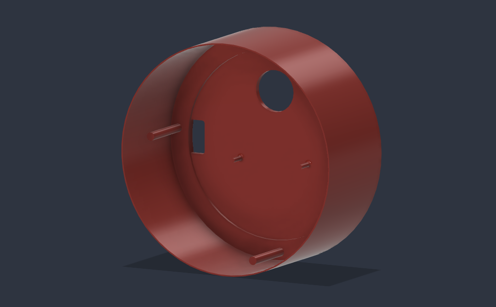
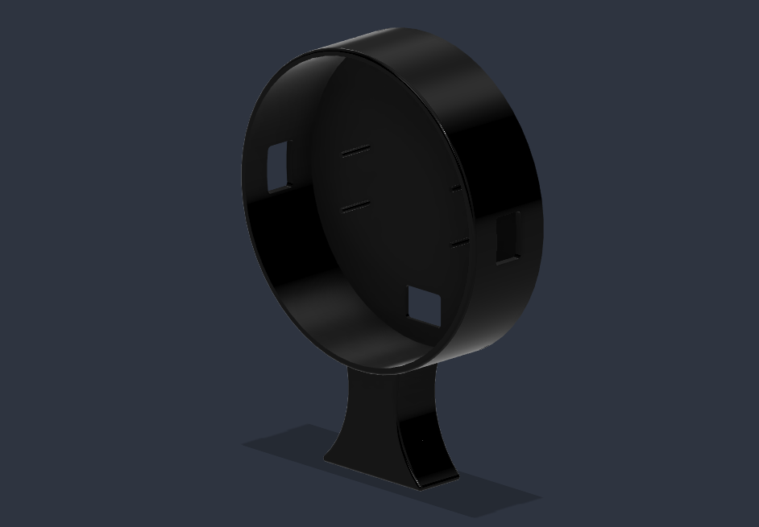
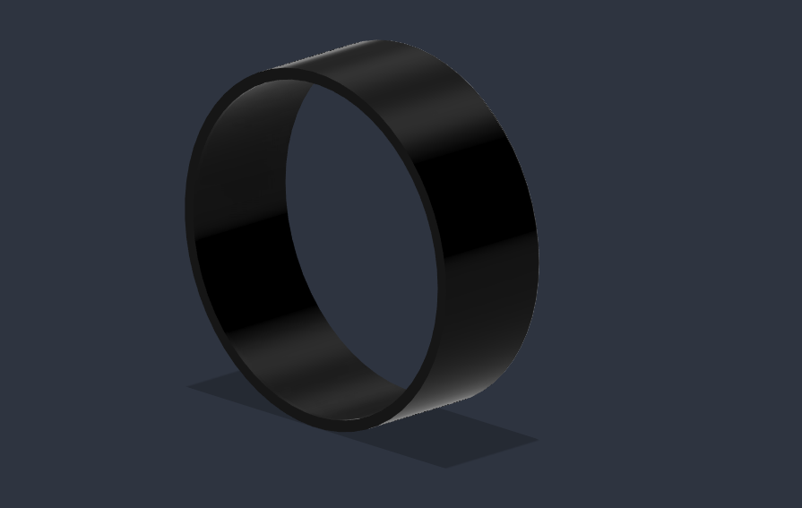
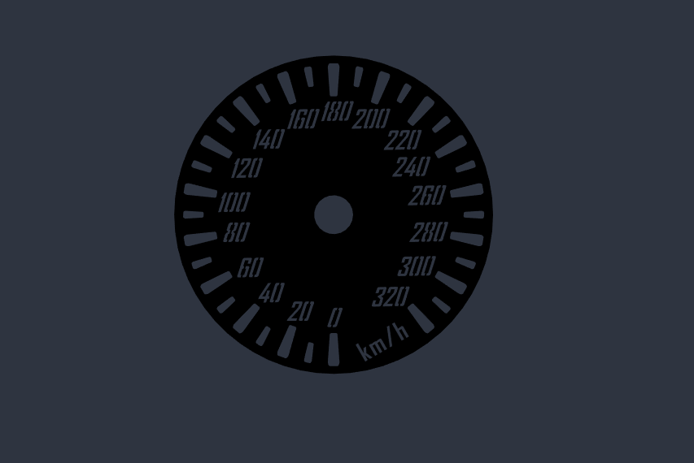
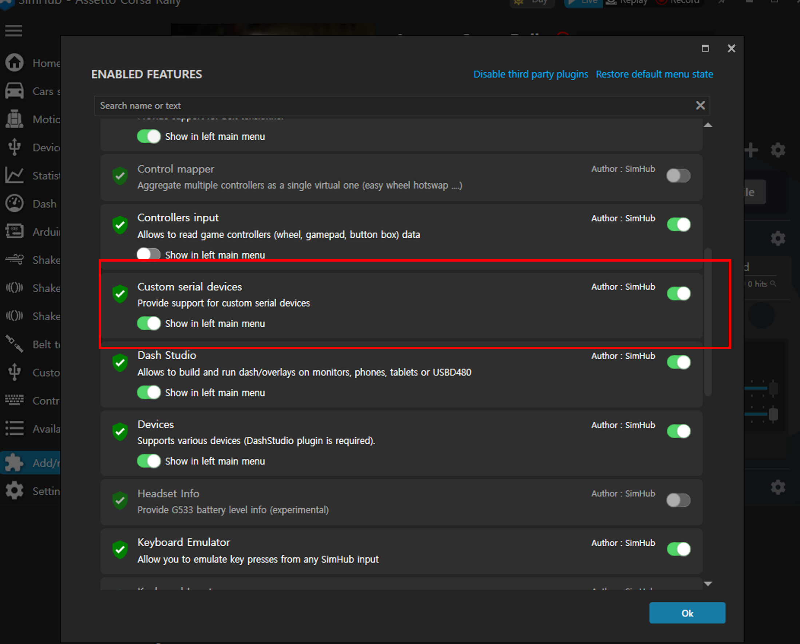
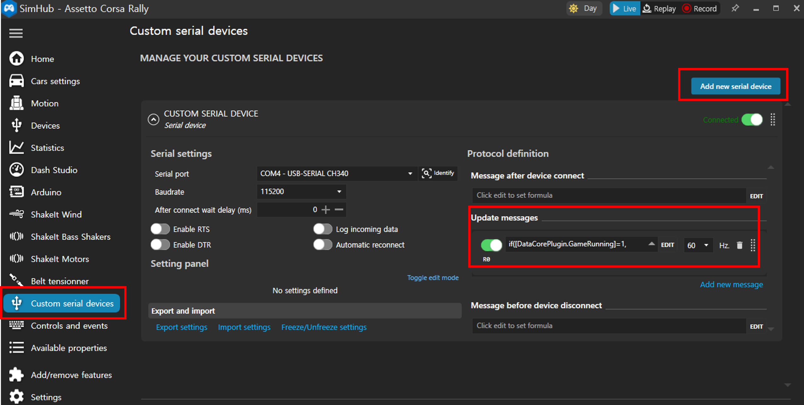
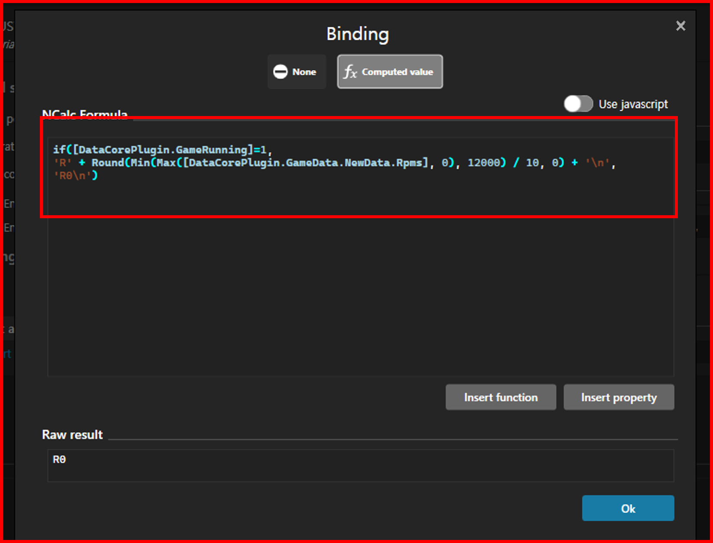
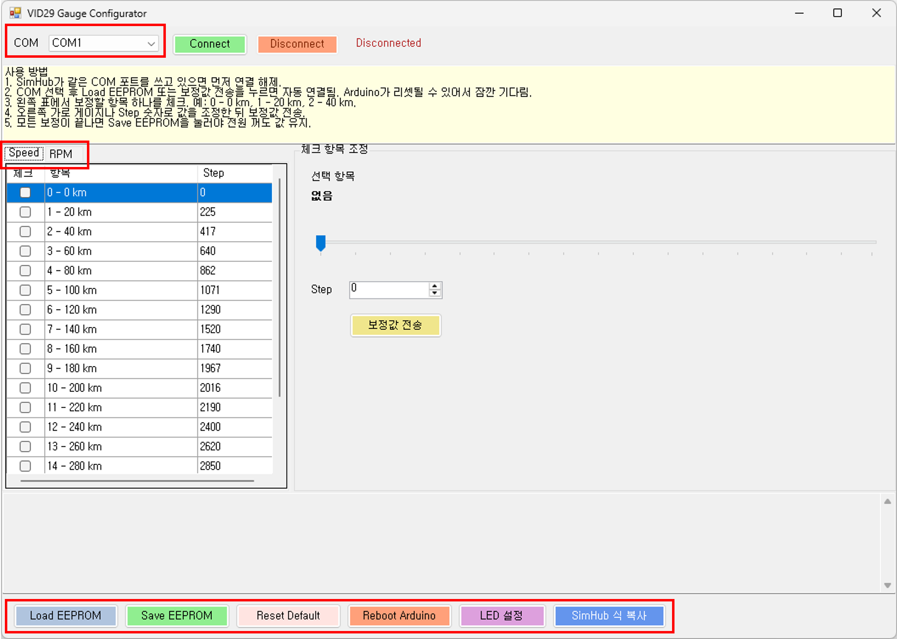
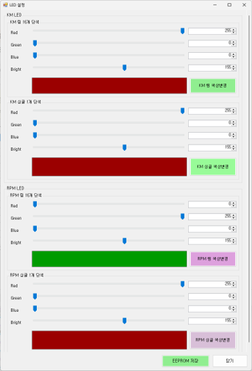
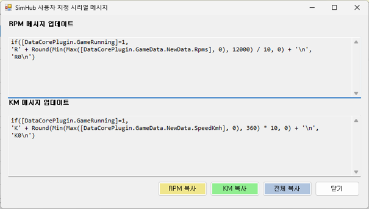

# TachoMeter

Speed(Km) / RPM 

## Credits

- **Design:** Lee Chiwon 
- **Development:** Lee Chiwon 
- **RGB Matix : ** Lee Chiwon

 

## 🎥 Video

---

# Hardware Wire

| Function    | Arduino | Ring LED Matrix | Single LED  | Motor  |
| ----------- | ------- | ------- | --------- |--------- |
| 5V                 | 5V          | 5V       | 5V          |
| GND                | GND         | GND      | GND         |
| Ring LED Matrix    | D6          | IN       |             |
| Single LED Bar     | D5          |          | IN          |
| Motor              | D9,D10,D11  |          |             | 1(D9), 2,3(D10), 4(D11)

 
---

# Part List 

|   Name              | EA | Site | Note | 
| ------------------- | ------ | --- | ------ |
| Arduino Nano   | 1 |  [Buy](https://smartstore.naver.com/misoparts/products/5779944205)| 국/내외 어디든 상관업음.
| Ring LED Matrix    | 1 |  [Buy](https://detail.tmall.com/item.htm?id=1035090948535&mi_id=0000gUlrvtFu5S64t1tqCFNuhOtfLKPjiB9Ap2ZIUPpeNy4&spm=tbpc.boughtlist.suborder_itempic.d1035090948535.37872e8dsNpH7A)| 16비트  WS2812 5050 RGB
| Single LED Bar    | 1 |  [Buy](https://detail.tmall.com/item.htm?id=1035090948535&mi_id=0000gUlrvtFu5S64t1tqCFNuhOtfLKPjiB9Ap2ZIUPpeNy4&spm=tbpc.boughtlist.suborder_itempic.d1035090948535.37872e8dsNpH7A)| 1비 WS2812 5050 RGB
| Motor    | 1 |  [Buy](https://item.taobao.com/item.htm?id=870730991204&mi_id=0000n-07sKJFhfhpx9YGWCMUwfIjtIyYDDo7LgTZTDCHjzY&spm=tbpc.boughtlist.suborder_itempic.d870730991204.37872e8dsNpH7A)| VID29-05
| Niddle    | 1 |  [Buy](https://item.taobao.com/item.htm?id=628805205024&mi_id=0000VkYcTL-KCI6JeJgxI6kfm_Xa8mfk7scPdLdVH7bH12c&spm=tbpc.boughtlist.suborder_itempic.d628805205024.37872e8dsNpH7A)| 36mm
| Acryl    | 1 |  [Buy](https://smartstore.naver.com/me41)| 3T 스모그/ 3D Print 폴더내 82.5mm 도면가지고 의뢰 하세요. 개당 1600원정도

# 3D Print

| Name |  EA  | Note |
| --- |  ------ |------ |
| 

  |  1EA  | 
| 

  |  1EA  | 
| 

  |  1EA  | 
| 

  |  1EA  | 
| 

  |  1EA  | 

# Simhub Arduino Uploading

# Simhub Setting
1. Add "Custom serial devices"

2. Add new serial device (Arduino Add)

3. Update Messages Edit

4. Software (Gauge Configurator)

 
 

## 🇰🇷 사용 방법

1. SimHub가 연결되어 있다면 먼저 연결을 해제합니다.
2. **COM Port**를 선택한 후 **Connect** 버튼을 클릭합니다.
3. 연결되면 바늘이 최대치까지 이동하며, EEPROM에 저장된 데이터를 자동으로 읽어옵니다. (EEPROM 읽어오는시간이 수초 발생됨)
4. **Speed** 또는 **RPM** 탭을 선택하여 사용하고자 하는 곳에 보정을 진행합니다.
5. 체크박스를 선택한 후 게이지를 조정하고 **보정값 전송** 버튼을 클릭하면 바늘이 움직입니다.
6. 보정이 완료되면 **Save EEPROM**을 눌러 설정을 저장합니다.
7. **Reboot Arduino**를 실행하여 보정값이 정상적으로 적용되었는지 확인합니다.
8. **LED 설정** 탭에서 LED 색상과 밝기를 변경한 후 **색상 변경** 버튼을 눌러 변경 사항을 확인합니다.
9. 원하는 설정이 완료되면 **Save EEPROM**을 눌러 저장합니다.
10. **SimHub 식 복사** 탭에는 **RPM** 및 **Km/h**용 **Update Messages** 서식이 제공됩니다. (동시에 두개 사용은 불가능합니다.)
11. 원하는 서식을 복사하여 SimHub의 **Update Messages** 항목에 붙여 넣습니다.

---

## 🇺🇸 Usage

1. If SimHub is connected, disconnect it first.
2. Select the **COM Port**, then click **Connect**.
3. Once connected, the gauge needle will move to its maximum position, and the application will automatically load the data stored in the EEPROM (this may take a few seconds).
4.Select the Speed or RPM tab for the gauge you want to calibrate.
5. Check the checkbox, adjust the gauge, and click **Send Calibration Data**. The gauge needle will move accordingly.
6. When calibration is complete, click **Save EEPROM** to save the settings.
7. Click **Reboot Arduino** to verify that the calibration has been applied correctly.
8. In the **LED Settings** tab, adjust the LED color and brightness, then click **Apply Color** to preview the changes.
9. When you are satisfied with the result, click **Save EEPROM** to store the settings.
10. The **SimHub Formula Copy** tab provides **Update Messages** formats for both **RPM** and **KM/H** modes. (The Speed and RPM modes cannot be used simultaneously.)
11. Copy the desired format and paste it into the **Update Messages** field in SimHub.

